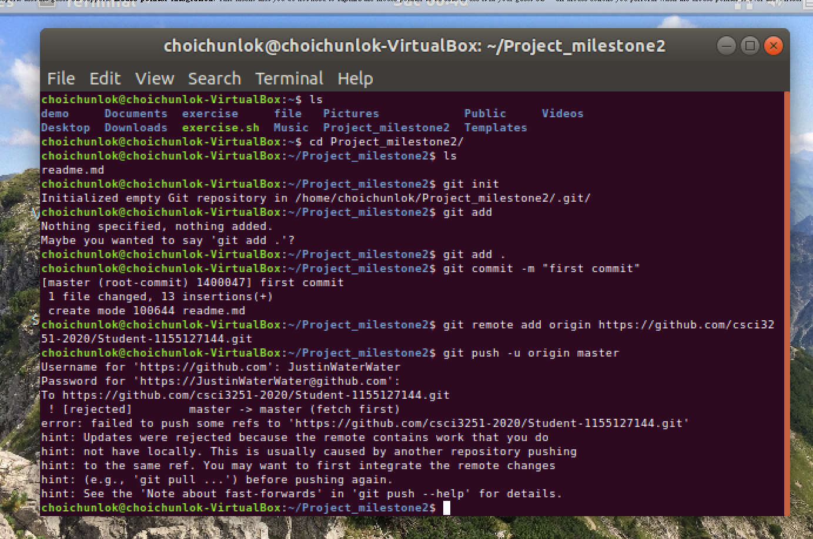

# Self Introduction
Hello, My name is Justin and I am now a year2 CS student. I know **nothing about programming in year1** but I will try my best to improve my skills.(Perhaps, I can)
## Programming Language Known
  * C
  * Java
## Things want to do before graduation
- [x] Not engineer-look-alike
- [ ] Facilitate in programming
## Interests 
Content | Reasons
------------ | ------------
Swimming | Seems no sweating during the progress
Programming | Spending quality time
## Screenshot Photo

